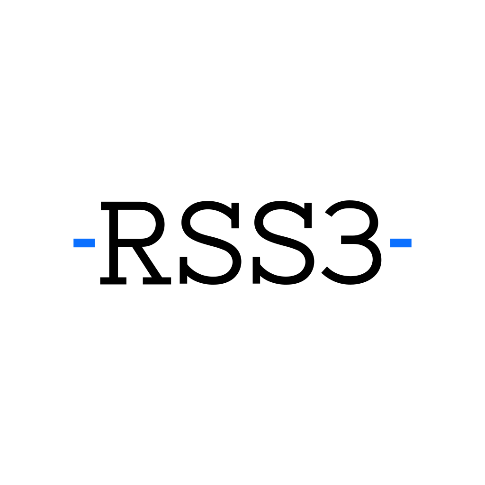

<!-- markdownlint-disable -->

  

  
  

<!-- markdownlint-enable -->

# RSS3 Arweave SDK

A high-performance and memory efficient Arweave SDK written in Go.

This is a work-in-progress, and is not intended for production use.

## Features

We are planning to add more features, stay tuned.

### Parsing Bundle Transactions

The SDK provides an efficient way to parse bundle tansactions without loading the entire transactions into the memory. Read more: [Implementing a High-Performance Arweave Bundle Parser](https://docs.rss3.io/docs/implementing-a-high-performance-arweave-bundle-parser).

## License

[MIT](LICENSE).
